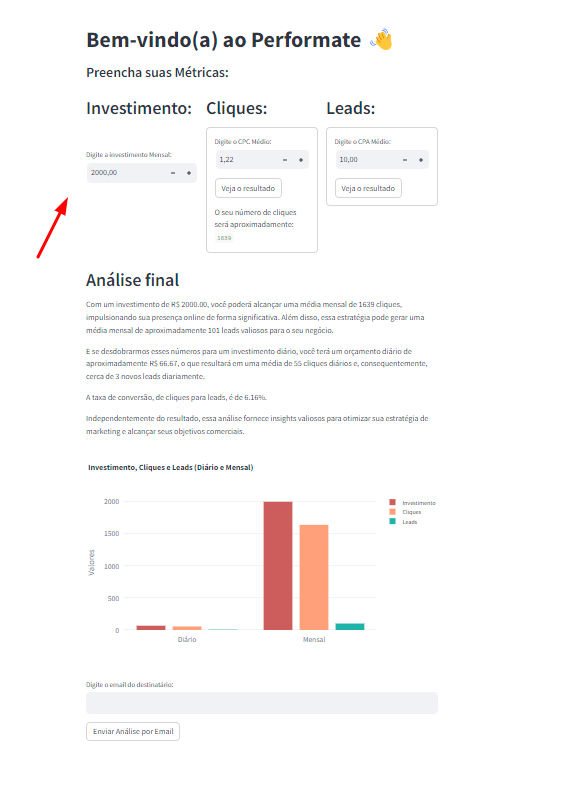

<!---
raquel-maia/raquel-maia is a ✨ special ✨ repository because its `README.md` (this file) appears on your GitHub profile.
You can click the Preview link to take a look at your changes.
--->

<h1 align="center" style="color:#9B30FF;">Hello, world! Me chamo Raquel Maia. Muito Prazer 👩🏽‍💻</h1>

   
<ul>

 

  
  
 
 

</ul>
   

   
<h1>🤖Tecnologias</h1>

    

<h1>Principais Projetos</h1>
 
  ## [Performate](https://perfomate.streamlit.app/)
  ## [Portfolio](https://raquel-maia.github.io/portfolio/)
  ## [Dicionário de Mulheres Negras](https://raquel-maia.github.io/dicionario/)
  ## [MyLinks](https://raquel-maia.github.io/my-links/)
  ## [DevLinks/Rockeseat](https://raquel-maia.github.io/rocketseat/)

  

 
 
 

 
<h1>📲Redes sociais</h1>

  
  
  
  

