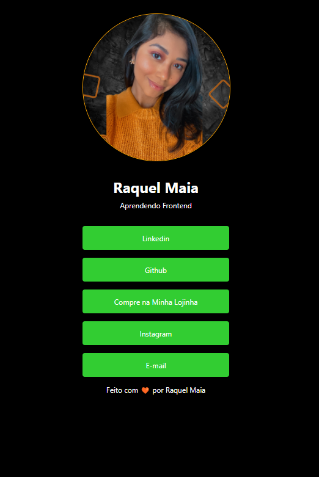
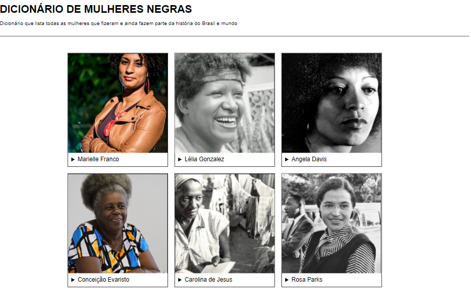

<!---
raquel-maia/raquel-maia is a ✨ special ✨ repository because its `README.md` (this file) appears on your GitHub profile.
You can click the Preview link to take a look at your changes.
--->

#  Alô mundo, me chamo Raquel Maia. Prazer 👩🏽
<ul>

🌵Nordestina

👩🏽‍💻No momento estou estudando Pyhton, SQL, Pandas, Banco de Dados, Computação em Nuvem (Participando do bootcamp da WomakersCode)

😊 Pronome: Ela/dela

</ul>

  <a href="https://github.com/raquel-maia">
  
  
   
   
   

   
<h1>🤖Tecnologias</h1>

 
  
  
  
  
  
  
  
  

  
  ##
  
  
 
    

<h1>Principais Projetos</h1>
<ul>
 
 ## [Portfolio](https://raquel-maia.github.io/portfolio/)
 ## [Dicionário de Mulheres Negras](https://raquel-maia.github.io/dicionario/)
 ## [MyLinks](https://raquel-maia.github.io/my-links/)
 ## [DevLinks/Rockeseat](https://raquel-maia.github.io/rocketseat/)
 
  ##  Confira!

  
  

</ul>

<h1>📲Redes sociais</h1>

  
  
  
  

